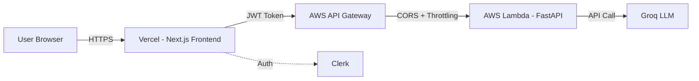

# 🛡️ SecureScript

> **AI-Powered Security Analysis for Python Code**  
> Find vulnerabilities instantly and fix them with streaming AI assistance.

[](https://secure-script-alpha.vercel.app)
[](LICENSE)
[](https://nextjs.org)
[](https://fastapi.tiangolo.com)

---

## ✨ Features

- 🔍 **Deep Security Analysis** — Detects OWASP Top 10 vulnerabilities using AI semantic analysis
- ⚡ **Instant Auto-Fix** — Streaming code fixes powered by Groq's Llama 3.3 70B
- 🔐 **JWT Authentication** — Secure backend with Clerk authentication
- 🚦 **Rate Limiting** — 7 requests/day per user + API Gateway throttling
- 🎨 **Modern UI** — Next.js 15 + Tailwind CSS + Shadcn UI

---

## 🏗️ Architecture



**Tech Stack:**
- **Frontend**: Next.js 15, React 19, Tailwind CSS, Clerk Auth
- **Backend**: FastAPI, Python 3.12, AWS Lambda
- **AI**: Groq (Llama 3.3 70B Versatile)
- **Infrastructure**: Terraform, AWS (Lambda + API Gateway), Vercel

---

## 🚀 Live Demo

**🌐 [https://secure-script-alpha.vercel.app](https://secure-script-alpha.vercel.app)**

1. Sign in with Google
2. Upload a Python file or paste code
3. Click "Analyze" to detect vulnerabilities
4. Click "Fix All" to stream secure code

---

## �️ Local Development

### Prerequisites
- Node.js 20+
- Python 3.12+
- [Groq API Key](https://console.groq.com)
- [Clerk Account](https://clerk.com)

### Backend Setup
```bash
cd backend
pip install -r requirements.txt

# Create .env file:
echo "GROQ_API_KEY=your_groq_key" > .env
echo "CLERK_FRONTEND_API=your-app.clerk.accounts.dev" >> .env
echo "REQUIRE_JWT_VERIFICATION=false" >> .env
echo "ALLOWED_ORIGINS=http://localhost:3000" >> .env

python server.py
```

### Frontend Setup
```bash
cd frontend
npm install

# Create .env.local file:
echo "NEXT_PUBLIC_CLERK_PUBLISHABLE_KEY=pk_test_..." > .env.local
echo "CLERK_SECRET_KEY=sk_test_..." >> .env.local
echo "NEXT_PUBLIC_API_URL=http://localhost:8000" >> .env.local

npm run dev
```

Visit `http://localhost:3000` 

---

## 📦 Deployment

### Backend (AWS Lambda via Terraform)
```bash
cd terraform/aws

# Configure variables
cp terraform.tfvars.example terraform.tfvars
# Edit terraform.tfvars with your API keys

# Deploy
terraform init
terraform apply
```

### Frontend (Vercel)
1. Push code to GitHub
2. Import project on [Vercel](https://vercel.com)
3. Set environment variables (Clerk keys, API URL)
4. Deploy! ✅

**Full deployment guide:** [Info/DEPLOYMENT-GUIDE-AWS-VERCEL.md](Info/DEPLOYMENT-GUIDE-AWS-VERCEL.md)

---

## Git Workflow

We use **GitHub Flow** for development:

```bash
# Create feature branch from develop
git checkout develop
git pull
git checkout -b feature/your-feature

# Make changes, commit, push
git add .
git commit -m "Add feature"
git push -u origin feature/your-feature

# Merge to develop for testing
git checkout develop
git merge feature/your-feature
git push

# Merge to main for production
git checkout main
git merge develop
git push  # Auto-deploys to Vercel
```

**Branches:**
- `main` → Production (auto-deploys to Vercel)
- `develop` → Staging/Testing
- `feature/*` → Active development

---

## Project Structure

```
.
├── backend/              # FastAPI backend
│   ├── server.py        # Main API server
│   ├── context.py       # Security analysis logic
│   └── package_linux/   # Lambda dependencies
├── frontend/            # Next.js frontend
│   ├── src/
│   │   ├── app/        # App Router pages
│   │   ├── components/ # React components
│   │   └── types/      # TypeScript types
│   └── public/         # Static assets
├── terraform/aws/       # Infrastructure as Code
│   ├── main.tf         # AWS resources
│   └── deploy.ps1      # Deployment script
└── Info/               # Documentation
```

---

## Security

- ✅ **JWT Verification** — Clerk JWKS validation
- ✅ **Rate Limiting** — 7 requests/day/user (app) + 10 RPS (infrastructure)
- ✅ **CORS Protection** — Strict origin whitelisting
- ✅ **DDoS Mitigation** — API Gateway throttling
- ✅ **No Secrets in Git** — All keys in environment variables

---

## Performance

- **Analysis Speed**: ~3-5 seconds (Groq LPU™)
- **Fix Streaming**: Real-time SSE (Server-Sent Events)
- **Cold Start**: <1s (AWS Lambda with 512MB)
- **Uptime**: 99.9% (AWS + Vercel)

---

## Contributing

Contributions are welcome! Please:
1. Fork the repository
2. Create a feature branch (`git checkout -b feature/amazing`)
3. Commit changes (`git commit -m 'Add amazing feature'`)
4. Push to branch (`git push origin feature/amazing`)
5. Open a Pull Request

---

## 📄 License

MIT License - See [LICENSE](LICENSE) for details.


<p align="center">
  <strong>Built by <a href="https://github.com/Mohamed-Noufal">Mohamed Noufal</a></strong><br>
  AI Engineer | Cybersecurity Enthusiast
</p>

<p align="center">
  <a href="https://secure-script-alpha.vercel.app">Live Demo</a> •
  <a href="Info/DEPLOYMENT-GUIDE-AWS-VERCEL.md">Deployment Guide</a> •
  <a href="SECURITY_GUIDE.md">Security Docs</a>
</p>
