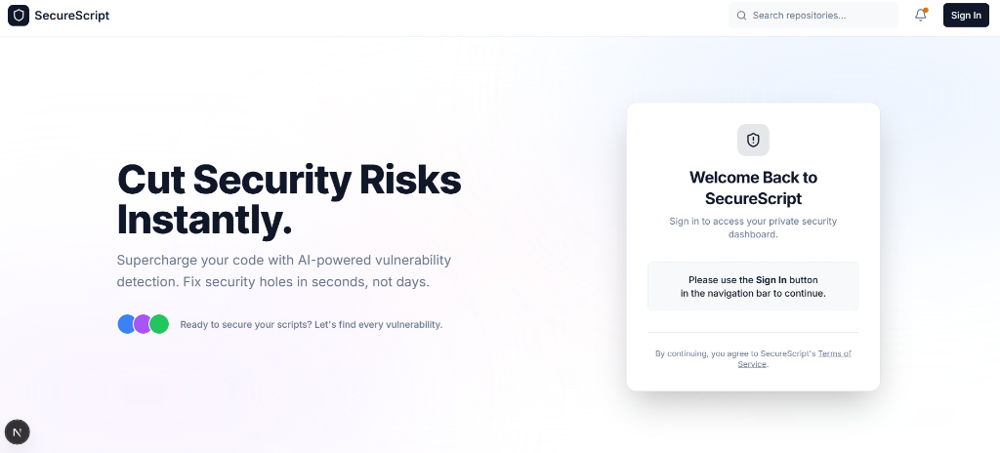

# 🛡️ SecureScript

> **AI-powered security analysis for Python code. Find vulnerabilities and fix them instantly.**



---

## ✨ Features

| Feature | Description |
|---------|-------------|
| 🔍 **Deep Security Analysis** | Detects OWASP Top 10 vulnerabilities using semantic AI, not regex |
| ⚡ **Instant Auto-Fix** | Streaming code fixes powered by Groq's LPU™ (Llama 3.3 70B) |
| 🔐 **JWT Authentication** | Secure backend with Clerk JWT verification |
| 🚦 **Rate Limiting** | 7 requests/day per user to prevent abuse |
| 🎨 **Modern UI** | Next.js 14 + Tailwind CSS + Shadcn UI |

---

## 🤖 AI Engineering Highlights

This project demonstrates advanced **AI Engineering** concepts:

### 🧠 Agentic Architecture
- **MCP Integration**: Model Context Protocol support for external tool orchestration (Semgrep)
- **Tool-Calling**: Structured tool definitions for security scanning capabilities
- **Streaming Responses**: Real-time SSE streaming for code fix generation

### 📝 Prompt Engineering
- **System Prompts**: Expert cybersecurity researcher persona for vulnerability analysis
- **Structured Output**: JSON schema enforcement for consistent, parseable security reports
- **Context Injection**: Dynamic code context insertion for accurate analysis

### 🔧 MCP Server Configuration
```python
# Example: Semgrep MCP Server Integration
MCPServerStdio(
    params={"command": "uvx", "args": ["semgrep-mcp"]},
    tool_filter=create_static_tool_filter(allowed_tool_names=["semgrep_scan"]),
)
```

---

## 🛠️ Tech Stack

### Frontend
- **Next.js 14** (App Router)
- **Tailwind CSS** & **Shadcn UI**
- **Clerk** (Authentication)

### Backend
- **FastAPI** (Python)
- **Groq** (Llama 3.3 70B Versatile)
- **OpenAI Agents SDK** (MCP Integration)
- **SlowAPI** (Rate Limiting)
- **PyJWT** (JWT Verification)

---

## 🚀 Quick Start

### Prerequisites
- Node.js 18+ & Python 3.12+
- [Groq API Key](https://console.groq.com)
- [Clerk Account](https://dashboard.clerk.com)

### Backend
```bash
cd backend
uv sync

# Add to .env:
GROQ_API_KEY=gsk_your_key
CLERK_FRONTEND_API=your-app.clerk.accounts.dev
REQUIRE_JWT_VERIFICATION=true

uv run server.py
```

### Frontend
```bash
cd frontend
npm install

# Add to .env.local:
NEXT_PUBLIC_CLERK_PUBLISHABLE_KEY=pk_test_...
CLERK_SECRET_KEY=sk_test_...

npm run dev
```

---

## 🧪 How to Use

1. **Sign In** with Clerk
2. **Upload** a Python file or paste code
3. **Analyze** to detect vulnerabilities
4. **Fix All** to stream secure code

---

## 🔒 Security

- ✅ JWT token verification (Clerk JWKS)
- ✅ Rate limiting per user
- ✅ CORS restricted to allowed origins
- ✅ No secrets in version control

---

## 📄 License

MIT License - Feel free to use for learning and personal projects.

---

<p align="center">
  Built by <a href="https://github.com/Mohamed-Noufal">Mohamed Noufal</a> • AI Engineer
</p>